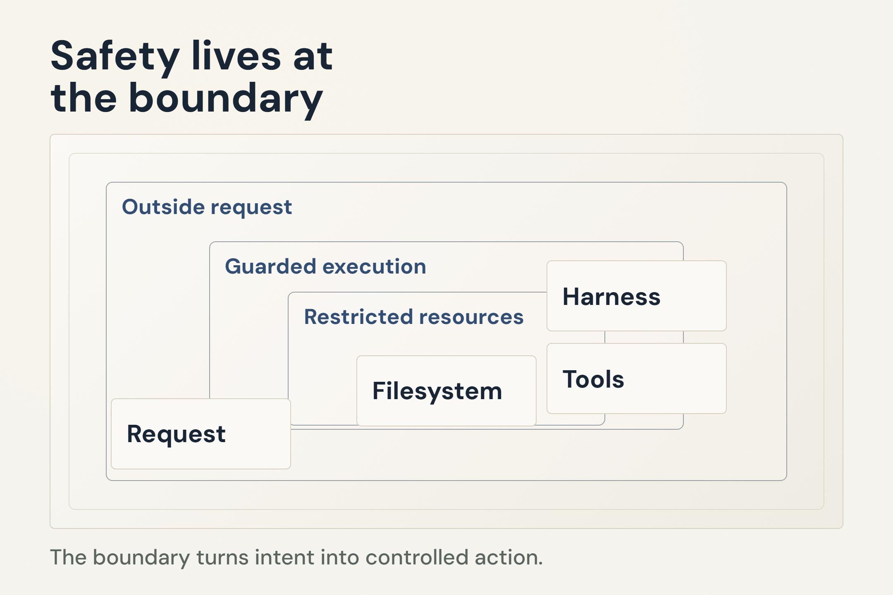
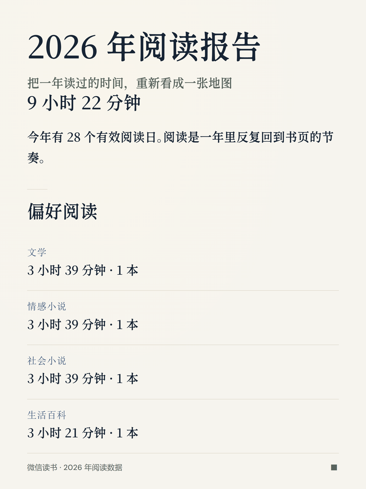
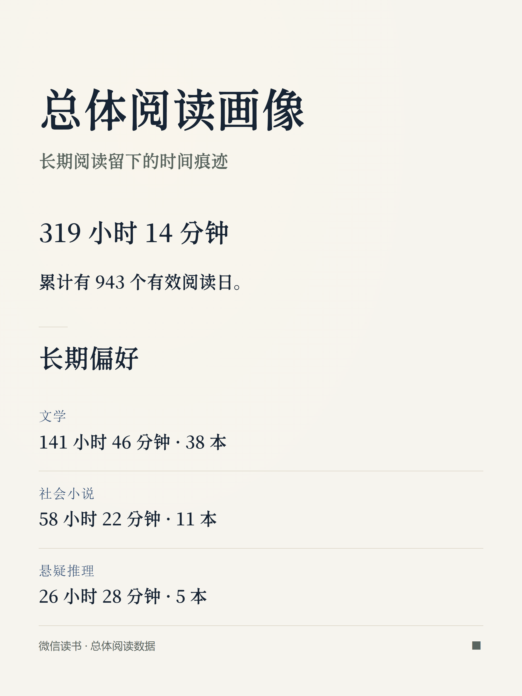
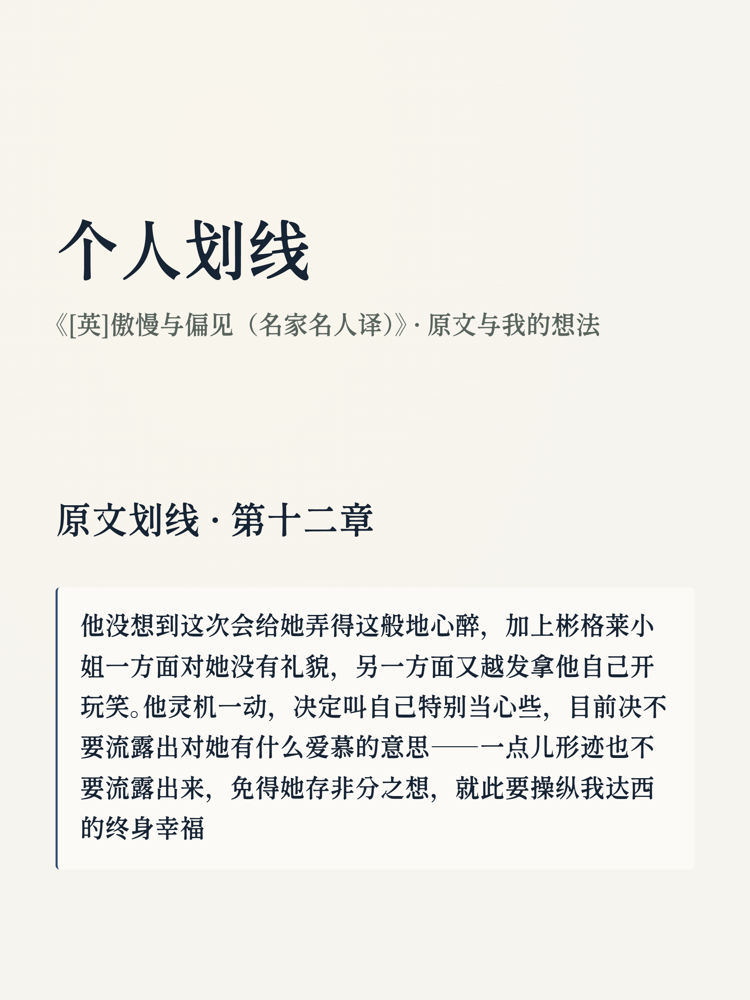

<p align="center"></p>

# card-skill

<p align="center"><strong>把文章、观点和论证，做成可以直接发布的图片。</strong><br>
<sub>Turn articles, ideas, and arguments into publish-ready visual cards.</sub></p>

<p align="center">
  <a href="#quick-start">最快开始</a> ·
  <a href="#choose-a-format">选择模具</a> ·
  <a href="#gallery">完整样张</a> ·
  <a href="#advanced">高级说明</a>
</p>

给 Claude Code、Codex、OpenCode、Pi 等 coding agents 使用的内容制图 skill。输入文章、笔记、观点、URL，或你明确指定的微信读书数据；card-skill 会理解内容结构，自动选择版式与 Quiet Paper 气质，输出经过检查的 PNG。

## 先看它能做什么

同一套安静的纸面骨架，可以承载不同的发布任务：封面负责制造张力，社媒卡片负责拆解观点，白板负责把推理关系画清楚。

<table>
<tr>
<td width="33.33%" valign="top">
<br>
<strong>公众号 / 博客头图</strong>
</td>
<td width="33.33%" valign="top">
<br>
<strong>小红书 / 社媒卡片</strong>
</td>
<td width="33.33%" valign="top">
<br>
<strong>白板推演</strong>
</td>
</tr>
</table>

<a id="quick-start"></a>
## 最快开始

### Codex（推荐）

card-skill 是完整安装包，渲染脚本、模板、字体、schema 和检查器都在包内。不要裸装仓库根目录；请安装插件：

```bash
codex plugin marketplace add KKenny0/card-skill
codex plugin add card-skill@card-skill
```

Codex 插件安装器不会执行 npm 生命周期脚本。首次制图时，agent 会在已安装的 skill 目录执行一次 `node scripts/setup-runtime.mjs`，安装锁定的 npm 依赖和 Playwright Chromium；后续使用会复用现有运行时。

### 复制一段自然语言请求

```text
把下面这篇文章做成一张公众号头图。不要复述摘要，提炼文章的核心张力，用安静的纸张质感呈现，完成后检查裁切、换行和可读性：

[在这里粘贴文章或 URL]
```

不需要 slash command；中文、英文自然语言都可以触发。默认不会先让你挑风格，也不会自动加入作者名或头像。

<details>
<summary>其他 agent 或临时使用</summary>

普通 agent 可以安装完整 skill 包；将 `-a codex` 换成对应 agent ID：

```bash
npx skills add KKenny0/card-skill/plugins/card-skill/skills/card-skill -a codex -g -y
cd ~/.agents/skills/card-skill
npm install
npx playwright install chromium
```

只想临时使用一次：

```bash
npx skills use KKenny0/card-skill/plugins/card-skill/skills/card-skill --skill card-skill
```

</details>

<details>
<summary>可选：在 Codex 对话中先看方向</summary>

在支持对话内交互卡片的 Codex 桌面会话中，可以明确要求先看方向，再决定是否出图：

```text
先给我 3 个公众号头图方向，用卡片展示每个方向的视觉隐喻、比例、适用理由和风险；我选定后再渲染 PNG。
```

选择后仍由现有 Stable / Creative 流程渲染、截图、检查并返回 PNG。普通请求不会被强制插入选择步骤；Codex CLI、IDE 或其他 agent 会退回文字候选列表。

</details>

<a id="choose-a-format"></a>
## 按任务选择模具

| 你要做什么 | 推荐 mode | 结果 |
|---|---|---|
| 公众号或博客头图 | `editorial-image` | 提炼情绪、核心张力和视觉隐喻，不把文章改写成 bullet points。 |
| 正文中的解释图 | `article-diagram` | 把局部论点压成公式卡、关系图、流程图或边界模型。 |
| 小红书或社媒系列 | `poster` / `big` / `long` | 从一句观点到多卡拆解，按内容密度选择画布。 |
| 论证、系统关系、技术决策 | `whiteboard` | 把问题、约束、路径和决策关系画清楚。 |
| 数据、叙事或个人反思 | `infograph` / `comic` / `sketchnote` | 在信息密度、冲突转折和手记感之间选择表达方式。 |

## 9 种内容模具

Stable 适合出版场景、批量生产和品牌一致性：走结构化 renderer、schema 校验和 `check-output`，输入正确时输出更确定。Creative 适合概念隐喻、叙事张力和个性化表达：布局更开放，需要人工审美兜底。

| Mode | Tier | 最适合 | 详细说明 |
|---|---|---|---|
| `editorial-image` | Stable / Creative | 公众号头图、博客 hero、正文氛围插图 | [mode-editorial-image](references/mode-editorial-image.md) |
| `article-diagram` | Stable | 正文公式卡、关系图、流程图、边界模型 | [mode-article-diagram](references/mode-article-diagram.md) |
| `poster` | Stable | 社媒系列卡片、章节拆分 | [mode-poster](references/mode-poster.md) |
| `whiteboard` | Stable | 论证、因果链、系统关系与技术决策 | [mode-whiteboard](references/mode-whiteboard.md) |
| `long` | Stable | 文章型长卡片与沉浸阅读 | [mode-long](references/mode-long.md) |
| `big` | Stable | 一句话观点、标题与宣言 | [mode-big](references/mode-big.md) |
| `infograph` | Creative | 数据、比较、层级与高密度信息 | [mode-infograph](references/mode-infograph.md) |
| `comic` | Creative | 冲突、转折或前后变化的叙事 | [mode-comic](references/mode-comic.md) |
| `sketchnote` | Creative | 个人反思、经验与温暖叙事 | [mode-sketchnote](references/mode-sketchnote.md) |

## Quiet Paper 与输出原则

所有模式共享同一套安静的纸面骨架：温暖纸色、克制墨色、细分隔线、小圆角、极少阴影。内容色调和品牌气质只改变表面温度、强调色和节奏，不把作品变成品牌皮肤拼盘。

- 默认根据内容结构、密度、情绪和发布用途自动选择 mode、design 与画面方向。
- `editorial-image` 会先判断 `reflective`、`sharp`、`warm` 或 `technical` 气质，再落到真实可渲染的 Quiet Paper design。
- `article-diagram` 会先筛出值得压缩的章节，再为每个章节生成公式卡；不适合压缩的铺垫、情绪和结论章节会被跳过。
- 默认署名、头像和来源字段为空；只有输入明确提供时才使用 `brand_name`、`logo`、`source`。

## 它怎样工作

1. 读取 URL、粘贴文本、微信读书返回的数据或本地文件。
2. 分析内容结构、密度、情绪与发布用途。
3. 匹配 mode、Quiet Paper design 和画面方向。
4. 使用结构化 renderer 或创意布局流程生成画面。
5. 在截图前后检查占位符、溢出、裁切、坏图、可读性、标题换行、字体栈和视觉体系漂移。
6. 通过 Playwright 截图并输出 PNG；默认写入 `~/Downloads/`。

<a id="advanced"></a>
<details>
<summary>高级：运行环境、更新与隐私</summary>

### 运行环境

安装 skill 需要 Node.js 22+ 与 npm。PNG 截图依赖 Playwright 和 Chromium；如果首次渲染提示缺少依赖，请在 skill 安装目录运行：

```bash
npm install
npx playwright install chromium
```

字体随 skill 一起分发。`assets/fonts/` 包含 4 个 OFL 1.1 开源字体，共约 57MB；字体 license 见 [`assets/fonts/LICENSE-fonts.md`](assets/fonts/LICENSE-fonts.md) 与 [`assets/fonts/OFL-1.1.txt`](assets/fonts/OFL-1.1.txt)。预检脚本会验证字体是否真加载，避免静默 fallback 到系统中文字体。

默认 `--dpr 2`。以常见的 1080 CSS 像素画布为例，导出的 PNG 宽度为 2160px；不同 mode 和比例会有不同高度，不应理解为固定的 4K 宽图。

### 更新提醒与隐私

每次 agent 开始使用 card-skill 时，会先运行一个非阻塞更新检查：一天最多一次，只读取 GitHub 上公开的 `VERSION` 文件；不会上传文章、prompt、路径或图片。检查失败会静默跳过，不影响出图。有新版时只提醒运行：

```bash
npx skills update card-skill -g -y
```

如需完全关闭，设置 `CARD_SKILL_DISABLE_UPDATE_CHECK=1`。只有明确提出微信读书请求时才会访问个人数据；个人内容会进入当前 Agent / 模型上下文用于整理，PNG 渲染与检查由本地脚本完成，不会自动上传或发布成品。

</details>

<details>
<summary>高级：CLI、自定义布局与 PNG 体积</summary>

结构化 CLI 可以单独使用：

```bash
node scripts/card.js --input /path/to/input.json --output ~/Downloads/card.png
```

支持的 CLI modes：`big`、`long`、`whiteboard`、`poster`、`editorial-image`、`article-diagram`。

`editorial-image` 的文章封面会用确定性的 `cover_motif` 把文章张力落到右侧主视觉；复杂头图、概念隐喻和正文配图仍优先使用 `content_html` + `custom_css`。`in-article` 与 `metaphor` 不会再静默回退到默认 scaffold。完整的 skill 行为与输入边界见 [`SKILL.md`](SKILL.md)。

默认 PNG 无损，长文卡可能达到 10–17MB。如需更小体积，可以单独使用 `pngquant`：

```bash
pngquant --quality=80-95 --force --output card.png card.png
```

</details>

<a id="gallery"></a>
## 完整样张

<details>
<summary>展开 gallery</summary>

<table>
<tr>
<td width="50%"><br><strong>editorial-image</strong> · blog hero</td>
<td width="50%"><br><strong>article-diagram</strong> · formula card</td>
</tr>
<tr>
<td><br><strong>infograph</strong></td>
<td><br><strong>big</strong></td>
</tr>
<tr>
<td><br><strong>long</strong></td>
<td><br><strong>sketchnote</strong></td>
</tr>
<tr>
<td><br><strong>comic</strong></td>
<td><br><strong>article-diagram</strong> · boundary model</td>
</tr>
</table>

</details>

## 微信读书（可选）

card-skill 可以和腾讯官方 [WeChatReading Skill](https://github.com/Tencent/WeChatReading) 组合使用，把你明确指定的一本书里的个人划线与想法做成卡组，或把个人阅读统计做成月报 / 年报。

它不读取任意章节正文，也不会因为只看到一本书名就扫描账号。腾讯 Skill 负责认证和读取；card-skill 只整理当前任务需要的数据，并在本地完成 PNG 渲染与检查。

<table>
<tr>
<td width="33.33%"><br><strong>年度阅读报告</strong></td>
<td width="33.33%"><br><strong>总体阅读画像</strong></td>
<td width="33.33%"><br><strong>个人划线卡组</strong></td>
</tr>
</table>

先单独安装官方来源 Skill，再按官方说明设置 `WEREAD_API_KEY`；不要把 API Key 粘贴到对话、卡片输入或仓库文件中：

```bash
npx skills add Tencent/WeChatReading -g
```

```text
把我在《千脑智能》里的个人划线和想法做成一组卡片。原文不要改写，把我的想法放在对应划线下面；没有明确对应关系的想法单独放，最后标明来源。

把我这个月的微信读书数据做成阅读月报。只使用真实返回的时长、天数、读完数量和偏好；缺少的模块直接省略，不要补造洞察。
```

## 分享案例与维护

如果 card-skill 帮你做出了值得发布的图，欢迎在 [GitHub Issues](https://github.com/KKenny0/card-skill/issues) 分享：最终图片或公开发布链接、使用的 prompt（敏感内容可删减）、mode 与 agent，以及仍需要手工调整的地方。

真实案例会帮助我们判断下一步该优化哪种发布任务；经作者同意后，优秀案例也可能进入 gallery，并保留来源署名。

你也可以通过 [Support](https://kkenny0.github.io/support/) 支持后续维护。支持会帮助我继续维护字体、浏览器渲染、图片压缩、模具质量和跨 agent 兼容性。

## Credits

card-skill 受到以下项目与实践启发：

- [awesome-design-md](https://github.com/VoltAgent/awesome-design-md) by VoltAgent — 品牌设计参考库。
- [ljg-card](https://github.com/lijigang/ljg-skills/tree/master/skills/ljg-card) by lijigang — 内容制图与早期品味规则。
- [Kami](https://github.com/tw93/kami) by tw93 — Quiet Paper 的纸面、墨色与节奏约束。
- [The New Yorker cover practice](https://www.newyorker.com/culture/video-dept/the-art-of-the-new-yorker-cover) 与 [GOV.UK image guidance](https://guidance.publishing.service.gov.uk/formatting-content/images/) — editorial image 的用途与克制原则。

## License

[MIT](LICENSE) © 2026 Kenny Wu
