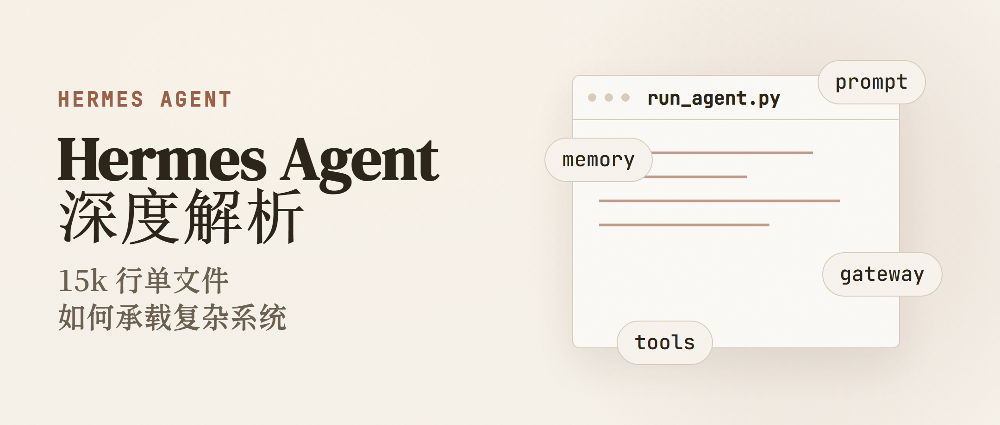
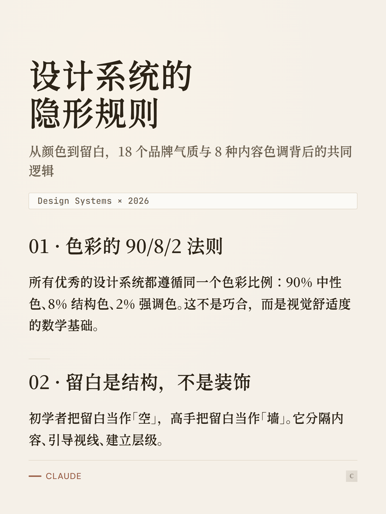
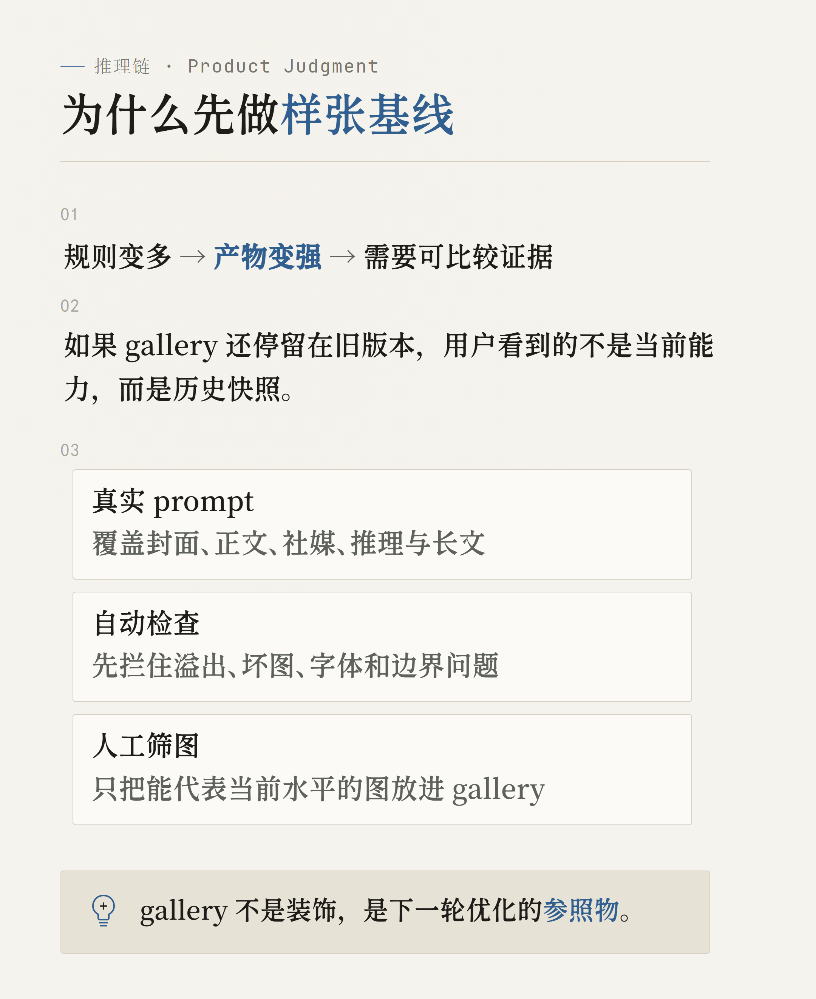
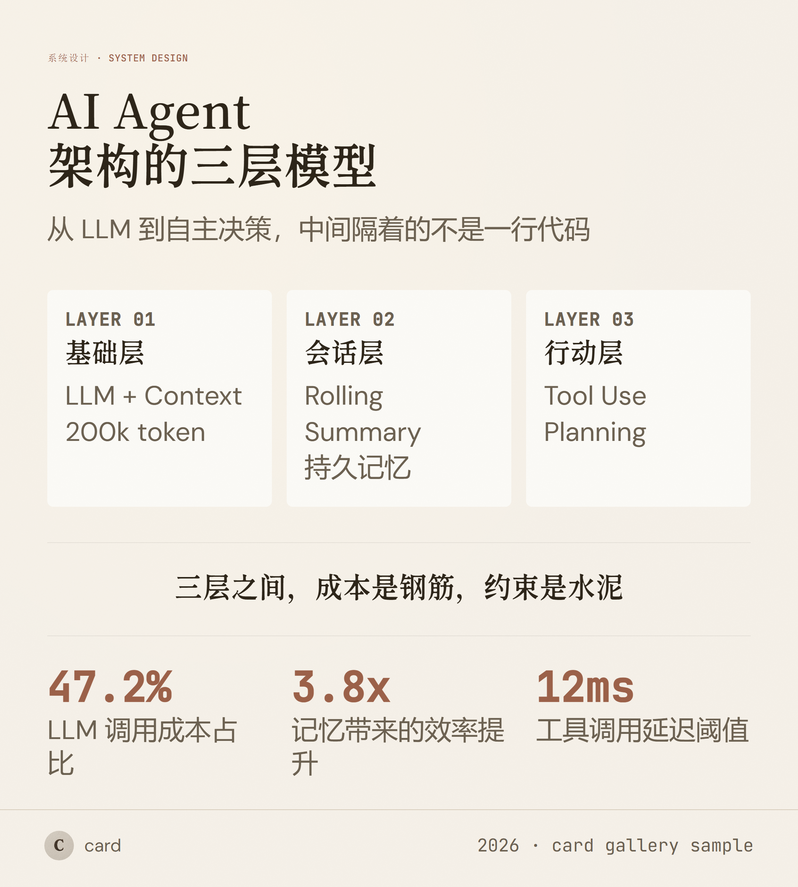
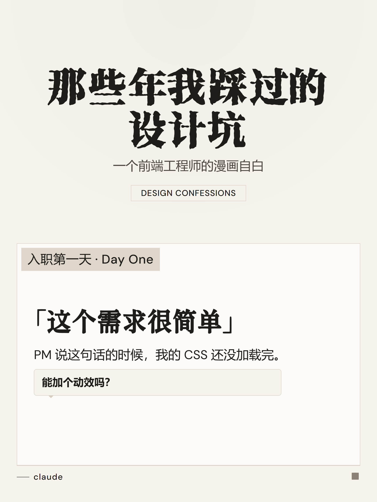
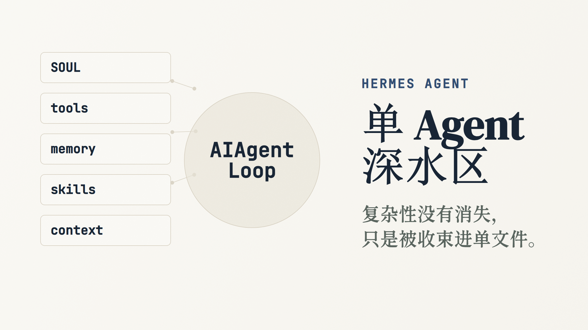
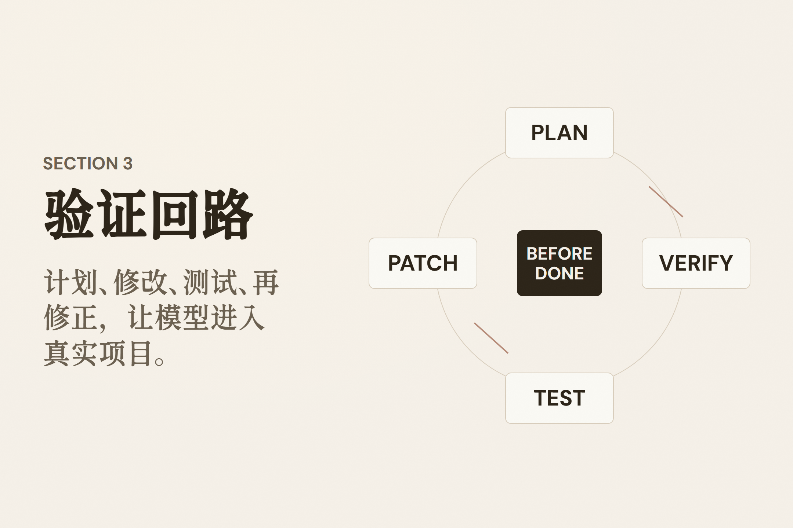

<p align="center"></p>

# card-skill

<p align="center"><strong>把文章、观点和论证，做成可以直接发布的图片。</strong><br>
<sub>Turn articles, ideas, and arguments into publish-ready visual cards.</sub></p>

给 Claude Code、Codex、OpenCode、Pi 等 coding agents 使用的内容制图 skill。输入文章、笔记、观点或 URL，它会理解内容结构，自动选择合适的版式与 Quiet Paper 气质，输出经过检查的 PNG。

## 看看它能做什么



<table>
<tr>
<td width="50%" valign="top">
<br>
<strong>小红书 / 社媒卡片</strong> · 把一个主题拆成可连续发布的卡片
</td>
<td width="50%" valign="top">
<br>
<strong>白板推演</strong> · 把论点、因果与决策链画清楚
</td>
</tr>
</table>

## 60 秒安装

安装到 Claude Code：

```bash
npx skills add KKenny0/card-skill -a claude-code -g -y
```

`skills add` 不会自动安装 Playwright 或 Chromium。首次出图前需完成一次环境设置：

```bash
cd ~/.claude/skills/card-skill
npm install
npx playwright install chromium
```

然后把一段内容或文章链接交给 agent，并直接说：

```text
把下面这篇文章做成一张公众号头图。不要复述摘要，提炼文章的核心张力，用安静的纸张质感呈现，完成后检查裁切、换行和可读性：

[在这里粘贴文章或 URL]
```

完成一次性环境设置后，agent 会自动选择 `editorial-image` 模式和适合的视觉方向，渲染、检查并返回一张 PNG（默认写入 `~/Downloads/`）；默认不会先让你挑风格，也不会自动加入作者名或头像。

使用 Codex：

```bash
npx skills add KKenny0/card-skill -a codex -g -y
```

OpenCode 或 Pi 用户把 agent ID 分别改为 `opencode` 或 `pi`。不要使用 `-a '*'`，它会为所有已知 agent 创建安装入口。不需要 slash command；中文、英文自然语言都可以触发。

## 从你要发布的东西开始

### 公众号 / 博客配图

适合文章头图、博客 hero、正文插图。它不会把文章再总结成 bullet points，而是提炼情绪、核心张力和视觉隐喻。

```text
给这篇关于 AI 如何改变个人知识管理的文章做一张公众号头图。画面要表达“记忆从仓库变成流动的工作台”，少字、克制，不要通用科技感。
```

### 小红书 / 社媒卡片

适合观点、方法论、章节拆解与系列内容。根据内容密度，可做单张大字报、信息图或多卡 poster。

```text
把这段“独立开发者如何判断一个功能值不值得做”的笔记做成 4 张社媒卡片。第一张提出冲突，中间两张讲判断标准，最后一张给行动清单；保留原意，不要写成营销文案。
```

### 白板推演

适合论证、系统关系、技术选型和决策链。重点是把推理关系画清楚，而不是装饰。

```text
把这段关于“为什么小团队应该先做单体应用”的论证画成白板推演：问题 → 约束 → 两条备选路径 → 决策。标出最脆弱的假设，不要补造数据。
```

## 8 种内容模具

card-skill 把 8 个 mode 分两层，承诺不同：

- **Stable**：走结构化 CLI renderer，schema 校验 + 双重 check-output。输入对了，输出就确定。失败时 schema 直接报错，不会乱出图。
- **Creative**：保留开放布局给真正需要创意的 mode，每次产物有差异，更依赖人工审美兜底。

| Mode | Tier | 最适合 |
|---|---|---|
| `editorial-image` | Stable | 公众号头图、博客封面、正文插图与概念隐喻 |
| `poster` | Stable | 小红书、社媒系列卡片、章节拆分 |
| `whiteboard` | Stable | 论证、因果链、系统关系与技术决策 |
| `long` | Stable | 文章型长卡片与沉浸阅读 |
| `big` | Stable | 一句话观点、标题与宣言 |
| `infograph` | Creative | 数据、比较、层级与高密度信息 |
| `comic` | Creative | 有冲突、转折或前后变化的叙事 |
| `sketchnote` | Creative | 个人反思、经验与温暖叙事 |

需要确定性输出（出版场景、批量生产、品牌一致性）优先选 Stable；需要画面创意（概念隐喻、叙事张力、个性化表达）选 Creative。

## Quiet Paper

所有模式共享同一套安静的纸面骨架：温暖纸色、克制墨色、细分隔线、小圆角、极少阴影。18 种品牌气质与 8 种内容色调只改变表面温度、强调色和节奏，不把作品变成品牌皮肤拼盘。

默认会根据内容的结构、密度与情绪自动选择 mode、design 和画面方向。只有你明确要求“给我几个方向”“先选风格”时，它才暂停等待选择；也可以直接指定 `Apple`、`Stripe`、`Linear`、`Claude`、`IBM`、`Notion` 等气质。

## 环境与首次运行

安装 skill 需要 Node.js 22+ 与 npm。PNG 截图依赖 Playwright 和 Chromium；仓库声明了 Playwright 依赖，但不会声称你的环境已经自动完成浏览器安装。

如果首次渲染提示缺少依赖，请进入本 skill 的安装目录后运行：

```bash
npm install
npx playwright install chromium
```

字体随 skill 一起分发。`assets/fonts/` 包含 4 个 OFL 1.1 开源字体（XiangcuiDengcusong、香萃打字机体 W15/W40、NanxiChuxiasong），共 ~57MB。安装时 `npx skills add` 自动拉取，无需额外下载。字体 license 见 `assets/fonts/LICENSE-fonts.md` 与 `assets/fonts/OFL-1.1.txt`。预检脚本会在每次出图时验证字体是否真加载，避免静默 fallback 到系统中文字体。

默认 `--dpr 2`。以常见的 1080 CSS 像素画布为例，导出的 PNG 宽度为 2160px；不同模式和比例会有不同高度，不应理解为固定的 4K 宽图。

### PNG 体积优化（可选）

默认 PNG 无损 4K，长文卡可能 10-17MB，Slack / 公众号会再压缩可能损失细节。如需更小体积，单独跑一次：

```bash
pngquant --quality=80-95 --force --output card.png card.png   # 11MB → 1-2MB，肉眼几乎无差
```

`pngquant` 是跨平台 CLI（macOS `brew install pngquant` / Ubuntu `apt install pngquant` / Windows 见 pngquant.org），skill 本身不依赖它。

## 它怎样工作

1. 读取 URL、粘贴文本或本地文件。
2. 分析结构、密度、情绪与发布用途。
3. 自动匹配 mode、Quiet Paper design 与画面方向。
4. 使用结构化 renderer 或创意布局流程生成画面。
5. 在截图前后检查占位符、溢出、裁切、坏图、正文可读性与标题换行。
6. 通过 Playwright 截图，输出 PNG；默认署名和头像均为空。

结构化 CLI 也可以单独使用：

```bash
node scripts/card.js --input /path/to/input.json --output ~/Downloads/card.png
```

支持的 CLI modes：`big`、`long`、`whiteboard`、`poster`、`editorial-image`。

可选署名与来源字段使用 `brand_name`、`logo`、`source`；默认全部为空，不会自动加入作者名、头像或维护者品牌。

## 更多样张

<details>
<summary>展开完整 gallery</summary>

<table>
<tr>
<td width="50%"><br><strong>infograph</strong></td>
<td width="50%"><br><strong>big</strong></td>
</tr>
<tr>
<td><br><strong>long</strong></td>
<td><br><strong>sketchnote</strong></td>
</tr>
<tr>
<td><br><strong>comic</strong></td>
<td><br><strong>editorial-image</strong> · blog hero</td>
</tr>
<tr>
<td><br><strong>editorial-image</strong> · body illustration</td>
<td><br><strong>Quiet Paper</strong> · structured information</td>
</tr>
</table>

</details>

## Showcase：让作品替工具说话

如果 card-skill 帮你做出了值得发布的图，欢迎在 GitHub Issues 分享：

- 最终图片或公开发布链接
- 使用的原始 prompt（敏感内容可删减）
- mode 与你使用的 agent
- 哪一步顺利、哪一步仍需要手工调整

真实案例会帮助我们判断下一步该优化哪种发布任务；经作者同意后，优秀案例也可能进入 gallery，并保留来源署名。

## Credits

card-skill 受到以下项目与实践启发：

- [awesome-design-md](https://github.com/VoltAgent/awesome-design-md) by VoltAgent — 品牌设计参考库。
- [ljg-card](https://github.com/lijigang/ljg-skills/tree/master/skills/ljg-card) by lijigang — 内容制图与早期品味规则。
- [Kami](https://github.com/tw93/kami) by tw93 — Quiet Paper 的纸面、墨色与节奏约束。
- [The New Yorker cover practice](https://www.newyorker.com/culture/video-dept/the-art-of-the-new-yorker-cover) 与 [GOV.UK image guidance](https://guidance.publishing.service.gov.uk/formatting-content/images/) — editorial image 的用途与克制原则。

## License

[MIT](LICENSE) © 2026 Kenny Wu
